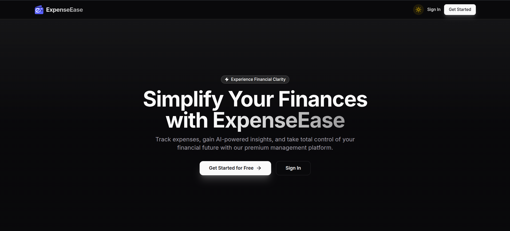

# 💸 ExpenseEase Tracker

## 🔗 Live Demo
👉 https://expense-ease.rahultech.in

---

## 📸 Preview


---

## 🧪 Demo Credentials

- **Email:** rdtech2002@gmail.com  
- **Password:** 123456  

---

## 🚀 About the Project

**ExpenseEase** is a full-stack web application designed to help users efficiently manage and analyze their expenses.

It not only allows tracking of daily expenses but also provides **AI-powered insights** to understand spending behavior better.

---

## ✨ Features

- ➕ Add, edit, delete, and view expenses  
- 📊 Categorize expenses (category, party, payment mode)  
- 📈 Visualize data using charts and graphs  
- 🤖 AI-generated insights on spending  
- 🔍 Advanced filtering (date, category, party, mode)  
- 📁 Export expenses as CSV  
- 🧾 Bulk edit expenses  
- 🔐 JWT-based authentication  
- ⏳ Auto logout after 24 hours  

---

## 🛠️ Tech Stack

### Frontend
- React
- Redux Toolkit + RTK Query
- TailwindCSS
- Chart.js
- React Router DOM
- React Hot Toast
- React Markdown
- React CSV

### Backend
- Node.js
- Express.js
- MongoDB + Mongoose
- JWT Authentication
- Multer (file uploads)
- Nodemailer (email service)
- Google Generative AI API


## ⚙️ Local Setup

### 1️⃣ Clone the Repository

```bash
git clone https://github.com/irahuldutta02/expense-ease-tracker
cd expense-ease-tracker
````

---

### 2️⃣ Setup Environment Variables

Create `.env` files in both:

* `client/`
* `server/`

Use the provided `sample.env` files as reference.

---

### 3️⃣ Run the Application

#### ▶️ Start Frontend

```bash
cd client
npm install
npm run dev
```

#### ▶️ Start Backend

```bash
cd server
npm install
npm run dev
```

---

## 🌐 Deployment

The application is deployed on a VPS with:

* Docker
* Nginx
---

## 👨‍💻 Author

[**Rahul Dutta**](https://www.linkedin.com/in/irahuldutta02)

---